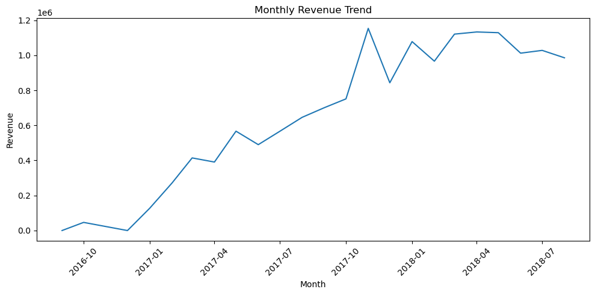
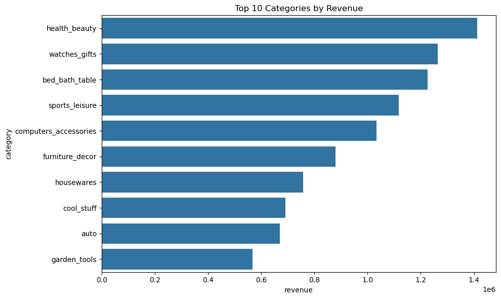
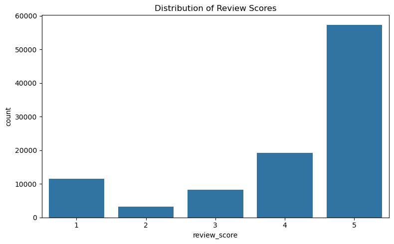

{\rtf1\ansi\ansicpg1252\cocoartf2868
\cocoatextscaling0\cocoaplatform0{\fonttbl\f0\fswiss\fcharset0 Helvetica;}
{\colortbl;\red255\green255\blue255;}
{\*\expandedcolortbl;;}
\margl1440\margr1440\vieww11520\viewh8400\viewkind0
\pard\tx720\tx1440\tx2160\tx2880\tx3600\tx4320\tx5040\tx5760\tx6480\tx7200\tx7920\tx8640\pardirnatural\partightenfactor0

\f0\fs24 \cf0 #  Olist Retail Analytics Project\
\
\
\
\
\
\
---\
\
#  Project Overview\
\
An end-to-end retail analytics project using **SQL, SQLite, Python, and Jupyter Notebook**.\
\
This project analyzes e-commerce business performance across:\
\
- Sales trends\
- Product performance\
- Customer behavior\
- Delivery operations\
- Customer satisfaction\
\
The goal is to convert raw transactional data into actionable business insights.\
\
---\
\
#  Business Problem\
\
An e-commerce company wants to understand:\
\
- Are sales growing over time?\
- Which product categories drive the most revenue?\
- Are customers returning or buying only once?\
- How do delivery delays impact customer satisfaction?\
- What actions can improve growth and retention?\
\
---\
\
# Tools & Skills Used\
\
## Tools\
- Python\
- SQLite\
- SQL\
- pandas\
- matplotlib\
- seaborn\
- Jupyter Notebook\
- GitHub\
\
## SQL Skills\
- Joins\
- CTEs\
- Window Functions\
- Aggregations\
- CASE WHEN\
- GROUP BY\
- ORDER BY\
\
## Analytics Skills\
- KPI Analysis\
- Customer Segmentation\
- Trend Analysis\
- Business Storytelling\
- Data Visualization\
\
---\
\
# \uc0\u55357 \u56514  Project Structure\
\
```text\
olist-retail-analytics/\
\uc0\u9500 \u9472 \u9472  notebooks/\
\uc0\u9500 \u9472 \u9472  sql/\
\uc0\u9500 \u9472 \u9472  visuals/\
\uc0\u9500 \u9472 \u9472  reports/\
\uc0\u9500 \u9472 \u9472  README.md\
\uc0\u9500 \u9472 \u9472  requirements.txt\
\uc0\u9492 \u9472 \u9472  .gitignore\
\
## Visualizations\
\
### Monthly Revenue Trend\
\
\
### Top Categories by Revenue\
\
\
### Review Score Distribution\
}